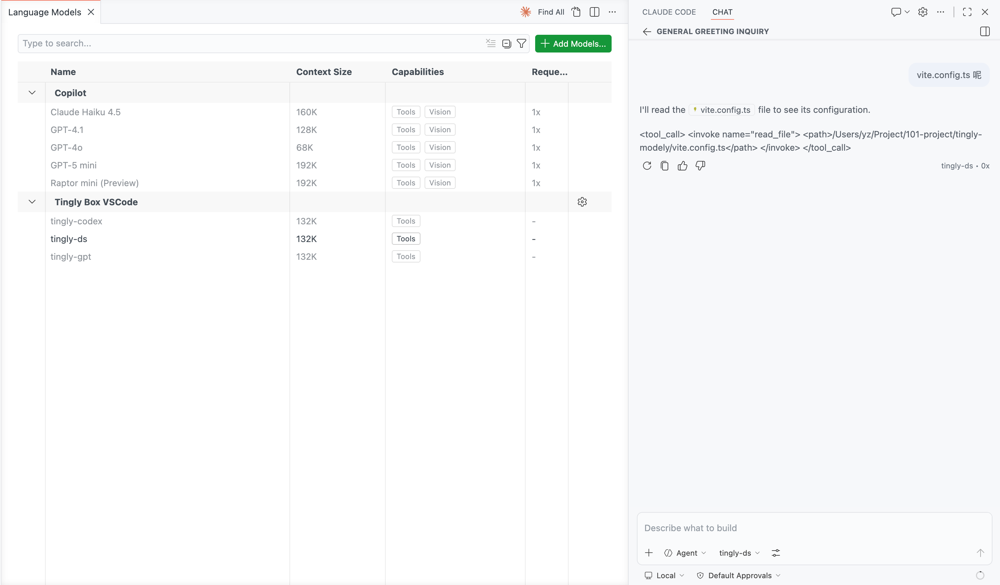
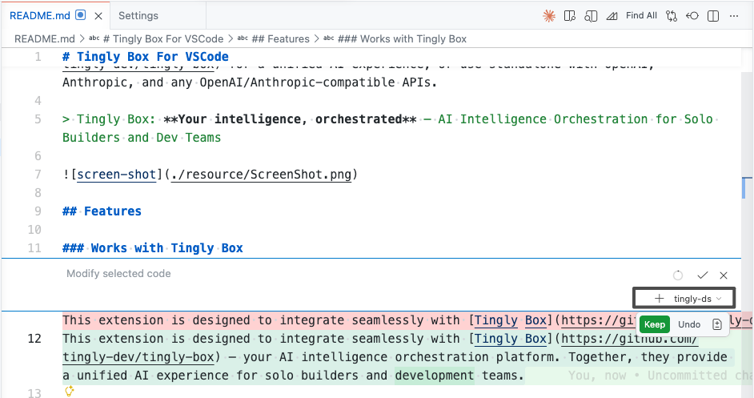
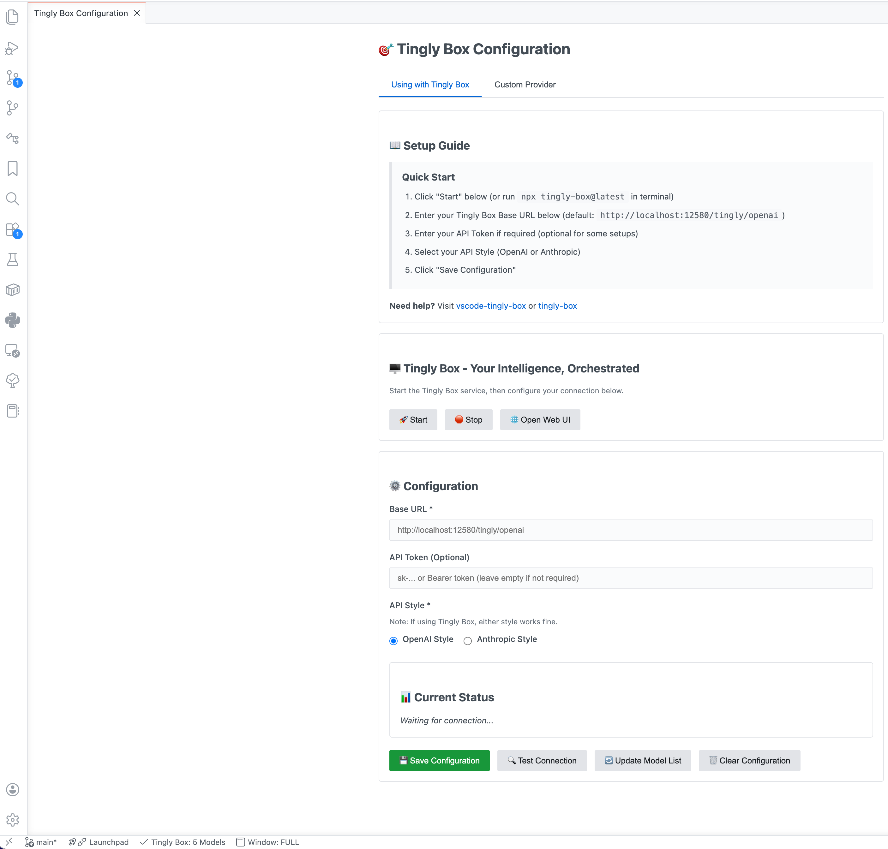

# Tingly Box For VSCode

Orchestrate your **Copilot Chat** with custom AI models powered by **Tingly Box**,
or use standalone with OpenAI, Anthropic, and any compatible providers.

> Tingly Box: **Your intelligence, orchestrated** — AI Intelligence Orchestration for Solo Builders and Dev Teams
>
> https://github.com/tingly-dev/tingly-box

> **🌟 Open Source & Free** — This extension is fully open source under MPL-2.0 license. Free to use, modify, and distribute.

<!--  -->

## Features

### Works with Tingly Box
This extension is designed to integrate seamlessly with [Tingly Box](https://github.com/tingly-dev/tingly-box) — your AI intelligence orchestration platform. Together, they provide a unified AI experience for solo builders and dev teams.

- **One-Click Server Control** — Start and stop Tingly Box server directly from the extension
- **Automatic Setup** — Built-in server management for hassle-free configuration
- **Unified AI Experience** — Connect to Tingly Box for orchestrated AI capabilities
- **Integrated Browser** — Open Tingly Box web interface directly in VS Code (no external browser needed)

### Standalone Capabilities
Works perfectly on its own too:

- **Custom Endpoints** — Connect to self-hosted models, proxies, or any OpenAI/Anthropic-compatible API
- **Streaming Responses** — Real-time streaming chat responses with full VS Code integration
- **Tool Calling** — Full support for models with function/tool calling capabilities
- **Status Bar Indicator** — Shows connection status and available model count at a glance
- **Secure Credential Storage** — API tokens stored securely in VS Code's SecretStorage
- **Model Discovery** — Automatically fetches available models from your configured endpoints
- **Webview Configuration UI** — Modern, intuitive interface for managing your settings

## Quick Start

Install plugin and click status bar to open tingly box for vscode config webview and follow the guide.
Recommand to use with Tingly Box.

> **Note**: You can also start Tingly Box manually by running `npx tingly-box@latest` in your terminal.

## Commands

| Command                                         | Description                                    |
| ----------------------------------------------- | ---------------------------------------------- |
| `Tingly Box: Manage Settings`                   | Open configuration webview                     |
| `Tingly Box: Start Server`                      | Start Tingly Box server                        |
| `Tingly Box: Stop Server`                       | Stop Tingly Box server                         |
| `Tingly Box: Open Web UI (System Browser)`      | Open Tingly Box web UI in system browser       |
| `Tingly Box: Open Web UI (Integrated Browser)`  | Open Tingly Box web UI in VS Code integrated browser |
| `Tingly Box: Show Status`                       | View current connection status                 |
| `Tingly Box: Fetch Models`                      | Refresh available models from API              |
| `Tingly Box: Manage Language Models`            | Open VSCode's language model management        |
| `Tingly Box: Reset Configuration`               | Clear all saved configuration                  |

## Status Bar

The extension adds a status bar item that shows:
- **⚠️ Setup Required** — Not configured, click to setup
- **✅ N Models** — Connected with N models available
- **⊘ Disconnected** — Configuration exists but connection failed

Click the status bar to quickly open the configuration webview.

## Settings

### VSCode Settings

- `tinglybox.debug` — Enable debug logging in output channel (default: `false`)

### Provider Configuration

Provider settings are configured through the webview UI and stored securely in VSCode's SecretStorage:

- **Base URL** — Your API endpoint (required)
- **Token** — API authentication token (optional)
- **API Style** — Message format: `OpenAI` or `Anthropic` (required)

## Supported Providers

### OpenAI-Compatible
- OpenAI (GPT-4, GPT-3.5, etc.)
- Azure OpenAI
- Any OpenAI-compatible endpoint

### Anthropic-Compatible
- Anthropic Claude (Sonnet, Opus, Haiku)
- Any Anthropic-compatible endpoint

### Recommendation

While you can use custom providers directly, we strongly recommend using [Tingly Box](https://github.com/tingly-dev/tingly-box) for the best experience:

- **Provider Compatibility** — Handles API differences between providers
- **Model Discovery** — Automatic model list fetching and caching
- **Seamless Switching** — Easy switching between providers and API styles
- **Unified Interface** — Single configuration for all your AI needs

Using the plugin independently requires your provider to guarantee API compatibility.

## Troubleshooting

### Connection Issues
- Check your Base URL is correct and accessible
- Verify your token if authentication is required
- Use "Test Connection" in the settings to diagnose issues
- Enable `tinglybox.debug` to see detailed logs in the output channel

### Models Not Showing
- Ensure your provider supports the `/models` endpoint
- Try "Fetch Models" command to refresh the model list
- Check the output channel for error messages

### Status Bar Shows Disconnected
- Your provider may be temporarily unavailable
- Check your network connection
- Verify your configuration is correct

## Requirements

- VS Code 1.104.0 or higher
- An API key from your chosen provider (if required)

## License

This project is open source under the [MPL-2.0 License](LICENSE.txt).

**What this means:**
- ✅ Free to use for personal and commercial projects
- ✅ Free to modify and extend
- ✅ Free to distribute (with proper attribution)
- ✅ Patent protections included

See [LICENSE.txt](LICENSE.txt) for full details.

## Links

- [VS Code Marketplace](https://marketplace.visualstudio.com/items?itemName=tingly-dev.vscode-tingly-box)
- [Source Code](https://github.com/tingly-dev/vscode-tingly-box)
- [Report Issues](https://github.com/tingly-dev/vscode-tingly-box/issues)
- [Tingly Box](https://github.com/tingly-dev/tingly-box)
